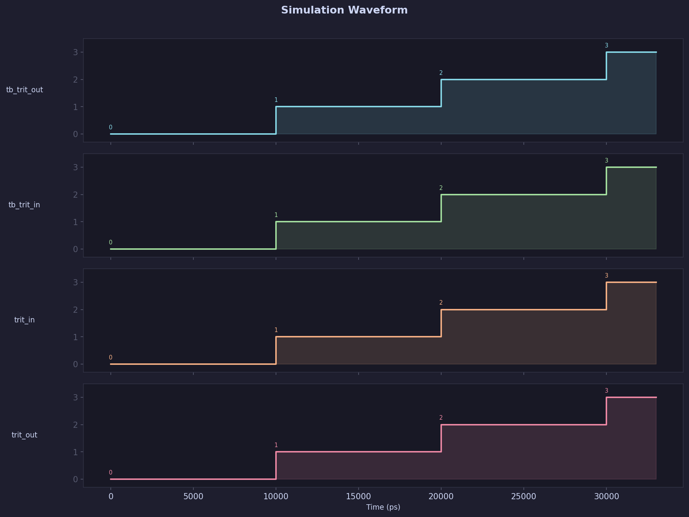

# 📊 EDA Report: `Ternary_Buffer_Demo`

> **Generated:** 2026-04-01 06:21:43 UTC  
> **Toolchain:** Icarus Verilog · GTKWave · Yosys · Netlistsvg  
> **Pipeline:** GitHub Actions — HDL Ecosystem

---

## 1. Simulation Log

```text
VCD info: dumpfile dump.vcd opened for output.
================================================
  HDL Ecosystem — Simulation Start
  Module: dut  |  Timescale: 1ns/1ps
================================================
  [0 ns] trit_in=00 (0) | trit_out=00 (0)
  [10000 ns] trit_in=01 (1) | trit_out=01 (1)
  [20000 ns] trit_in=10 (2) | trit_out=10 (2)
  [30000 ns] trit_in=11 (3) | trit_out=11 (3)
================================================
  Simulation Finished at 40000 ps
================================================
../scripts/universal_tb.v:46: $finish called at 40000 (1ps)
```

---

## 2. Compilation Output

```text
_Not available._
```

---

## 3. Waveform Analysis

### Signal Waveform




---

## 4. Gate-Level Synthesis

### Gate-Level Schematic


> Generated by `netlistsvg` from Yosys JSON netlist.


---

## 5. Hardware Metrics

### Hardware Summary

| Metric | Value |
|--------|-------|
| Total Cells | **5** |
| Estimated Transistors | **30** |
| Estimated Die Area | **0.3 µm²** |
| Reference Node | 7nm CMOS (educational estimate) |
| Wire Count | 0 |
| Port Count | 0 |

> ⚠️ Area & transistor counts are **educational estimates** based on generic 7nm CMOS assumptions. Actual values depend on the target PDK and P&R tool.

### Cell-Level Breakdown

| Cell Type | Count | Transistors Each | Transistors Total |
|-----------|------:|-----------------:|------------------:|
| `$_ANDNOT_` | 2 | 6 | 12 |
| `$_OR_` | 2 | 6 | 12 |
| `$_AND_` | 1 | 6 | 6 |


---

## 6. Timing Analysis

```text
╔══════════════════════════════════════════════╗
║       Timing Analysis Report (Estimated)     ║
╚══════════════════════════════════════════════╝

⚙ Reference Node  : Generic 7nm CMOS (educational)
⚙ Analysis Method : Gate-level delay accumulation

── Critical Path ───────────────────────────────
  DFF Clk-to-Q delay   : 0.1 ns
  Combinational delay   : 0.25 ns
  Setup time            : 0.03 ns
  ─────────────────────────────────────────────
  Critical path total   : 0.38 ns
  Max frequency (est.)  : 2631.58 MHz

── Hold Time ───────────────────────────────────
  Hold time             : 0.01 ns

── Gate Delay Breakdown ────────────────────────
  $_ANDNOT_            x   2  →  delay/gate: 0.05 ns
  $_OR_                x   2  →  delay/gate: 0.05 ns
  $_AND_               x   1  →  delay/gate: 0.05 ns

── Note ────────────────────────────────────────
  Educational estimate using generic 7nm gate delays. For accurate timing, use OpenSTA with a process-specific Liberty (.lib) file.

  For production-grade timing: add OpenSTA +
  a Liberty file (.lib) from your target PDK.
```

---

## 7. Artifacts

| File | Description |
|------|-------------|
| `simulation_log.md` | This report |
| `waveform.png` | GTKWave timing diagram |
| `schematic.svg` | Gate-level schematic (netlistsvg) |
| `schematic_gates.svg` | Yosys `show` gate diagram |
| `timing_report.txt` | Timing analysis / critical path |
| `hardware_metrics.json` | Structured metrics (JSON) |
| `synth_netlist.v` | Post-synthesis Verilog netlist |

---

<sub>🤖 Auto-generated by the HDL Ecosystem Pipeline · Do not edit manually</sub>
