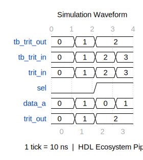
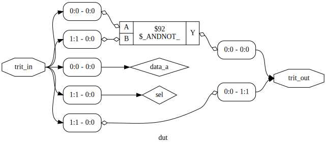

# 📊 EDA Report: `Ternary_MUX_2to1`

> **Generated:** 2026-04-01 07:23:15 UTC
> **Toolchain:** Icarus Verilog · WaveDrom · Yosys · Netlistsvg
> **Pipeline:** GitHub Actions — HDL Ecosystem

---

## 1. Simulation Log

```text
VCD info: dumpfile dump.vcd opened for output.
================================================
  HDL Ecosystem — Simulation Start
  Module: dut  |  Timescale: 1ns/1ps
================================================
  [0 ns] trit_in=00 (0) | trit_out=00 (0)
  [10000 ns] trit_in=01 (1) | trit_out=01 (1)
  [20000 ns] trit_in=10 (2) | trit_out=10 (2)
  [30000 ns] trit_in=11 (3) | trit_out=10 (2)
================================================
  Simulation Finished at 40000 ps
================================================
../scripts/universal_tb.v:46: $finish called at 40000 (1ps)
```

---

## 2. Compilation Output

```text
_Not available._
```

---

## 3. Waveform Analysis

### Signal Waveform



> *Rendered by WaveDrom · Click image to open full view*


---

## 4. Gate-Level Synthesis

### Gate-Level Schematic (netlistsvg)


> *Click to open full schematic.*

### Yosys Gate Diagram



> *Click to open full gate diagram.*


---

## 5. Hardware Metrics

### Hardware Summary

| Metric | Value |
|--------|-------|
| Total Cells | **1** |
| Estimated Transistors | **6** |
| Estimated Die Area | **0.06 µm²** |
| Reference Node | 7nm CMOS (educational estimate) |
| Wire Count | 4 |
| Port Count | 0 |

> ⚠️ Area & transistor counts are **educational estimates** based on generic 7nm CMOS assumptions. Actual values require PDK-specific P&R.

### Cell-Level Breakdown

| Cell Type | Count | Transistors Each | Transistors Total |
|-----------|------:|-----------------:|------------------:|
| `$_ANDNOT_` | 1 | 6 | 6 |


---

## 6. Timing Analysis

```text
╔══════════════════════════════════════════════╗
║       Timing Analysis Report (Estimated)     ║
╚══════════════════════════════════════════════╝

⚙ Reference Node  : Generic 7nm CMOS (educational)
⚙ Analysis Method : Gate-level delay accumulation

── Critical Path ───────────────────────────────
  DFF Clk-to-Q delay   : 0.1 ns
  Combinational delay   : 0.05 ns
  Setup time            : 0.03 ns
  ─────────────────────────────────────────────
  Critical path total   : 0.18 ns
  Max frequency (est.)  : 5555.56 MHz

── Hold Time ───────────────────────────────────
  Hold time             : 0.01 ns

── Gate Delay Breakdown ────────────────────────
  $_ANDNOT_            x   1  →  delay/gate: 0.05 ns

── Note ────────────────────────────────────────
  Educational estimate using generic 7nm gate delays. For accurate timing, use OpenSTA with a process-specific Liberty (.lib) file.

  For production-grade timing: add OpenSTA +
  a Liberty file (.lib) from your target PDK.
```

---

## 7. Generated Files

| File | Description |
|------|-------------|
| [`simulation_log.md`](simulation_log.md) | This report |
| [`waveform.svg`](waveform.svg) | WaveDrom timing diagram (SVG) |
| [`waveform.png`](waveform.png) | Timing diagram (PNG fallback) |
| [`schematic.svg`](schematic.svg) | Gate-level schematic (netlistsvg) |
| [`schematic_gates.svg`](schematic_gates.svg) | Yosys gate diagram |
| [`timing_report.txt`](timing_report.txt) | Timing analysis / critical path |
| [`hardware_metrics.json`](hardware_metrics.json) | Structured metrics (JSON) |
| [`synth_netlist.v`](synth_netlist.v) | Post-synthesis Verilog netlist |


---

<sub>🤖 Auto-generated by the HDL Ecosystem Pipeline · Do not edit manually</sub>
